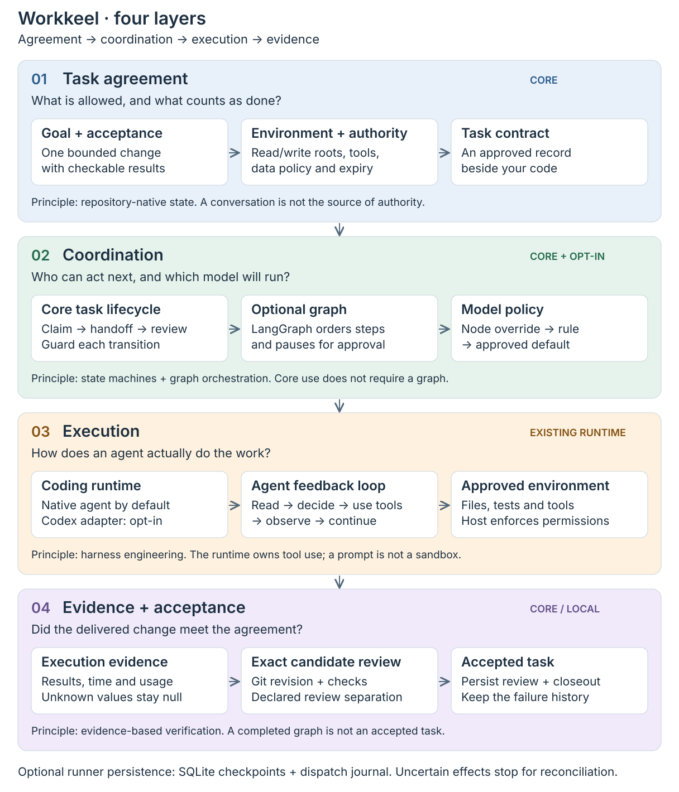

# Workkeel

A repository-native workflow framework for coding agents.

**Keep tasks, model choices and verified results connected—even when conversations change.**

English · [繁體中文](README.zh-TW.md) · [日本語](README.ja.md)

[](https://github.com/zsz1210/workkeel/actions/workflows/ci.yml)
Early Alpha · Node.js 24+ · [MIT](LICENSE)

## Why Workkeel?

Coding agents can implement a change. Delivering it across several steps or
conversations introduces different problems: lost decisions, duplicated work,
unclear permissions, expensive default models and results nobody actually reviewed.

Workkeel keeps the task agreement beside your code and connects it to execution
and evidence. Use it to:

- **Resume with context:** preserve approved scope, ownership, handoffs and failures.
- **Control execution:** define dependencies, approvals, bounded retries and recovery.
- **Choose models deliberately:** route suitable steps to Luna or Sol through your
  existing Codex subscription, with explicit overrides and no silent Astra fallback.
- **Review what was delivered:** bind checks and a distinct Agent's review to an
  exact Git revision before accepting it.

Your coding runtime still owns the coding loop and tools. Workkeel coordinates
work around it; it is not an application framework or a replacement model.

## From request to accepted change

<picture>
  <source media="(max-width: 640px)" srcset="docs/assets/workkeel-workflow-mobile.svg">
  
</picture>

Want to see the states move? Download or open
[`workkeel-flow.html`](docs/assets/workkeel-flow.html) from your clone in a browser.
Play, pause or step through approval, rework and interruptions. It works offline;
it is an explanation, not live telemetry. GitHub displays the HTML source only.

For example: inspect a cart-total bug with Luna, pause for the approved approach,
then implement and test with Sol. Preserve evidence, hand off the candidate, and
have a different Agent review it. A graph finishing is not approval, acceptance
or deployment. [Complete workflow guide →](docs/operations/workkeel-workflows.md)

## Start from source

Requires Git, Node.js 24+ and an existing coding agent. This development source is
not yet a published Workkeel npm release.

```sh
git clone https://github.com/zsz1210/workkeel.git
cd workkeel
npm ci --omit=optional --ignore-scripts
node bin/workkeel.mjs help
```

Follow the [quick start](docs/getting-started/workkeel.md) to initialize your
project, approve a task, claim it and record review. The previewable
[AGENTS/CLAUDE bridge](docs/extensions/workkeel-context.md) preserves existing
instructions. Native coordination works with your current coding agent.

For automatic graph execution, install optional dependencies with
`npm ci --include=optional --ignore-scripts` and follow the
[Codex subscription setup](docs/operations/workkeel-workflows.md#choose-how-to-run).
The experimental profile currently targets macOS and a pinned Codex version; no extra
API key or LiteLLM server is required. It selects models for Workkeel-launched
steps, not existing desktop conversations or your global model default.

## Defaults, options and support

| Capability | Default | Available support and boundary |
| --- | --- | --- |
| Task coordination | Core / on | Repository task contract, claims, handoffs and exact-candidate review; no server required |
| Coding agent | Your existing agent | Codex, Claude Code or another instruction-following agent; native use does not select its model |
| Graph engine | Off / opt-in | LangGraph packages plus an approved workflow; sequences, branches, direct joins and checkpoints |
| Automatic model selection | Off / opt-in | Workkeel policy: node override → matching rule → approved default; no classifier model call |
| Codex monthly subscription | Opt-in / experimental | Existing ChatGPT login; macOS and pinned Codex host; bounded Luna/Sol samples passed, not general reliability qualification |
| LiteLLM gateway | Off / optional | Fixed approved connection only; no bundled server; live qualification pending |
| LiteLLM Auto Router | Not integrated | Distinct from Workkeel policy routing; not enabled by the gateway option |
| Headroom | Off | Lossless views via a host-owned integration; no native Codex tool-output interception |
| Task monitor | Off / optional | `workkeel monitor /path/to/project`: on-demand, read-only task/run view; no model calls or background service. [Guide](docs/operations/workkeel-measurements.md#optional-task-monitor) |
| Task measurements | Recorded during workflow execution | Read-only model/token/time queries; native host sessions remain unobserved. [Guide](docs/operations/workkeel-measurements.md) |

There is no universal Luna/Sol/Astra default: a native agent keeps its own setting;
an automatic workflow must supply its approved policy. No macOS app or mandatory
background daemon is installed. See [runtime setup and limits](docs/operations/workkeel-workflows.md).

Personal development routing is separate from the framework: an external,
opt-in LiteLLM heuristic can suggest Luna/Sol before a native Codex launch. It is
not the LiteLLM Auto gateway, does not switch this app's existing conversations,
and is not bundled. See [the bounded evaluation](docs/validation/workkeel-development-routing.md).

## Architecture

<picture>
  <source media="(max-width: 640px)" srcset="docs/assets/workkeel-architecture-mobile.svg">
  
</picture>

The repository holds task authority and review evidence. The optional runner
handles graph progress and model policy. Codex executes inside host-enforced
permissions. SQLite checkpoints and a dispatch journal support recovery; uncertain
side effects stop for reconciliation instead of blind replay.

## Concepts used

| Related concept | How Workkeel applies it |
| --- | --- |
| Agent harness engineering | Explicit task boundaries, runtime contracts and evidence checks around the coding agent |
| Context engineering | Task-specific instructions, relevant Skills and bounded evidence; optional lossless tool-output views |
| State machines and graph orchestration | Guarded task states; LangGraph sequences, branches, direct joins and checkpoints |
| Feedback loops and human-in-the-loop | Bounded continuation, approval interrupts and review/rework cycles |
| Policy-based model routing | Approved model rules, explainable selection and conversation-pinned settings |

See [terminology](docs/concepts/terminology.md) and [architecture](docs/concepts/architecture.md).
Skills provide project methods; recording that a Skill was read does not prove it
was applied well. [Selection and outcome checks →](docs/extensions/workkeel-context.md)

## Evidence and limits

Latest offline verification passed 1,403 cases; the earlier automation baseline also passed nine model-free sandbox checks.
The final subscription check failed after Luna incorrectly rejected a still-valid
authorization; execution stopped before Sol. Automatic execution remains experimental,
not a qualified reliable workflow or evidence of subscription savings.
[Methods, results and remaining qualification →](docs/validation/workkeel-automation.md)

Headroom preserves exact originals, but this adapter cannot automatically compress
Codex native tool output. LiteLLM is optional, with live qualification pending.
Locks are local and identities are attributed; this Alpha does not promise
distributed coordination or authenticated human approval.

[Documentation](docs/README.md) · [Testing](docs/getting-started/testing.md) ·
[Contributing](CONTRIBUTING.md) · [Security](SECURITY.md) ·
[Compatibility and migration](docs/getting-started/workkeel.md#legacy-history-and-migration)

[MIT](LICENSE). See [third-party notices](THIRD_PARTY_NOTICES.md) for dependency
licenses and optional integration provenance.
