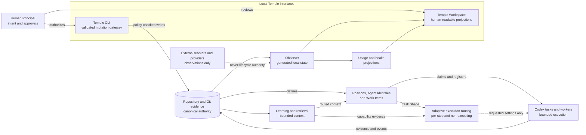

# Architecture

## Workkeel task-first boundary

The current opt-in mode coordinates approved tasks in the repository. A
`workkeel.lock` pins the CLI and explicit Agent/Principal approval policy. Each
`.ai-org/work-items/` record keeps an immutable contract, current claim, exact
candidate, evidence digests, review, closeout and failed-attempt history.

The host coding agent executes the work and enforces actual tool, filesystem,
network and data controls. Optional project Skills supply specific procedures;
they are not authority or a mandatory generic model-capability catalog. Model
transport is separate: native settings are the default and a fixed gateway can
be described in a read-only plan. There is no new execution loop or automatic
task-first provider launch. See the [guide](../getting-started/workkeel.md) and
[ADR-0072](../adr/0072-task-first-lifecycle.md).

The remaining sections describe **legacy Temple compatibility mode**, not the
required setup for a new task-first project. This toolkit still self-hosts that
legacy operating contract until a separately approved migration can preserve it.

## System boundary at a glance



Solid arrows show governed project flow. Dotted arrows are deliberately weaker: an external tracker or Provider may contribute an observation, and the routing layer may describe requested execution settings, but neither completes a Work Item, satisfies QA, grants release authority, or launches work. Temple Workspace reads generated projections; canonical changes still pass through the local CLI and repository evidence.

## Three routes, three decisions


Temple routes three different decisions after human direction and Work Item scope are known:

The legacy taxonomy keeps engineering methods and execution adaptation as separate
layers in the [legacy vision](vision.md#the-seven-framework-layers).

| Route | Question | Primary input | Output | It does not |
|---|---|---|---|---|
| Responsibility Route | Who may own this step? | Position, Assignment or Membership, Discipline, authority boundary | Responsible Position and eligible Agent Identity | Grant authority from capability, Skill, model, or company title |
| Context Route | What should that Position read now? | Work Item, Position, lifecycle stage, purpose, Context Map, Learning, Capability Registry | Bounded source selection and body-free manifest | Copy source authority, expand scope, or estimate Tokens |
| Adaptive Execution Route | How should this bounded step be attempted? | Task Shape, required capabilities, constraints, observations, project Execution Policy | Eligible execution profile, requested model and reasoning settings, rejection reasons | Launch a Provider, guarantee the effective model, or advance lifecycle state |

This separation prevents a role name from becoming an accidental model policy. A Developer may perform a mechanical edit, a complex refactor, or a visual review; those steps can need different execution capabilities even though responsibility stays with the same Position. Conversely, the same execution profile can support several Positions without granting any of them new authority.

Provider-reported effective settings, latency, Token counts, and outcomes may later become evidence for **Model Calibration**. Calibration is a reviewed project-policy change, not an automatic feedback loop. Historical familiarity can inform onboarding and preference only when the evidence is compatible with current capability and policy constraints. See [Adaptive execution routing](adaptive-execution-routing.md), [Model routing](../getting-started/model-routing.md), and [ADR-0046](../adr/0046-separate-adaptive-execution-routing.md).

## Identity and collaboration model

```text
Local Actor Binding ── binds clone to ──> Human Principal
                                           │ sponsors
                                           ▼
                                    Agent Identity
                                           │ joins with Disciplines
                                           ▼
Position Membership ── eligible for ──> Position (framework-defined)
         │                                 │ responsibility
         └──────────── claim ─────────────> Work Item + Evidence

Human Principal ── holds ──> Human Authority Grant ── governs ──> bounded approval
```

- The central framework defines each Position's ID, responsibilities, and gates.
- An Agent Identity has a stable `agent_id` and mutable `display_name`; renaming must not change its historical ID.
- An Assignment has an activation state and preserves one default Agent per Position for backward compatibility.
- A Position Membership adds eligible pool members and technical Disciplines without changing Position responsibility or Human Authority.
- A Human Principal has an immutable ID, may share a display name with another Principal, sponsors an Agent Identity, and remains attributable when that Agent claims work.
- A clone-local actor binding lives below the Git common directory and contains attribution evidence but no credential.
- A Human Authority Grant is scoped, risk-bounded, revocable, and separate from company title, Agent capability, and Git-hosting permission.
- A Work Item claim binds Principal, Agent, base revision, branch, optional worktree, and timestamps to one bounded scope.

Codex `.codex/agents/*.toml` files are runtime configuration for Positions, not names of project participants. Actual project names are stored in `.ai-org/project/agents.json`.

See [Collaborative development model](../operations/collaboration.md) for the complete architecture and work-decomposition diagrams.

## Naming boundary

`Workkeel` is the public framework name. `Temple` identifies its retained legacy
CLI and technical namespace, not an installed project's identity.

- The repository and source package are `zsz1210/workkeel` and `@zsz1210/workkeel`.
  The `temple` compatibility CLI, `temple.lock`, `temple.*` schemas, CLI-specific
  Skill IDs and compatibility markers retain stable names. General-purpose Skills use neutral names.
- After installation, project-facing instructions, status, artifacts, and Agent descriptions use the project name or "this project's AI development organization."
- Project members are not called the Temple team, and the central framework brand does not replace product identity.
- `TEMPLE.md` remains temporarily as a compatibility filename, but its contents are the repository's organizational operating contract, not another external project.

This boundary allows safe central framework upgrades while making installed content a natural part of the product repository.

## File boundaries

| Type | Path | Ownership | Upgrade rule |
|---|---|---|---|
| Managed | Exact files listed in `temple.lock.managed_files`, drawn from `templew.mjs`, `.ai-org/core/**`, `.ai-org/templates/**`, core or installed-pack `.agents/skills/**`, `.codex/agents/**`, and `TEMPLE.md` | Central framework | Update only when the locked checksum matches the installed file |
| Project-owned | Every unlisted file, including repository-local `.agents/skills/**`; `.ai-org/project/**` including `spec-index.json`, `context-map.json`, learning records and index, work items, decisions, events, artifacts, adapters, and root `AGENTS.md` | Project | Never overwritten or silently adopted by init, pack install, or upgrade |
| Generated | `.ai-org/views/**`, including status, Capability Registry, parallel dispatch plans, tracker observations and plans, work-item Context Capsules, policy scorecards, and usage baselines | CLI/Observer | Rebuildable from canonical state |

`temple.lock` records the framework version, exact managed-file checksums, installed optional packs, feature states, `AGENTS.md` integration state, and a version-pinned CLI bootstrap contract. A clean source installation also records the exact Git source revision used by the project launcher. Directory prefixes are allowed source roots, not ownership claims. An untracked collision stops before writing even when its contents match the proposed managed file. See [ADR-0013](../adr/0013-governed-skill-extensions.md) and [ADR-0022](../adr/0022-recoverable-runtime-dispatch.md).

Read-only protocol inspections such as `usage preflight` are ephemeral rather than a fourth authority layer. Detailed thread usage may be correlated with registered repository tasks; optional account activity remains account-wide and unallocated. Neither source mutates lifecycle state, and account activity is never copied into the project baseline.

The toolkit repository is the only explicit exception shape, not an exception to ownership. `temple init . --self-host` records a distinct installation mode, keeps root project state separate from `project-overlay/`, and may adopt only the one declared byte-identical bootstrap Skill already needed to start initialization. The normal project path never adopts identical untracked files. See [ADR-0030](../adr/0030-self-host-the-toolkit-with-explicit-boundaries.md).

## Canonical state

The framework uses Git-friendly JSON and Markdown:

- `project.json`: project identity and initialization time.
- `agents.json`: Agent Identities.
- `assignments.json`: mappings from Positions to Identities.
- `collaboration.json`: selected profile, Human Principals, sponsorship history, qualified Position Memberships, scoped Human Authority Grants, temporary bootstrap and recovery state, and tiered validation gates.
- `tasks.json`: stable IDs, Positions, Agents, revisions, and states for separate user-owned Codex tasks and threads; internal subagents do not enter this registry and it is not an app-control API.
- `runtime-workers.json`: internal-subagent or user-task reservations tied to an exact Work Item claim, plan, wave, runtime identity, evidence, and optional task record.
- `resources.json`: project-defined runtime or verification capacity and worker-owned active or released reservations.
- `spec-index.json`: compact identity, authority, status, source, revision, approval, and relationship metadata for product, UX, UI, API, and technical specifications. It points to authoritative documents rather than copying their bodies.
- `tracker.json`: selected external-planning profile, provider identities, mapping granularity, field ownership, and read/write policy. It contains no credentials.
- `context-map.json`: compact project-owned routes to important Specs, ADRs, domain sources, runbooks, tests, and documentation; it contains paths and retrieval metadata, not copied source bodies.
- `retrieval.json`: selected deterministic provider and the unconfigured local-hybrid privacy and fallback boundary.
- `execution-policy.json`: project-owned capabilities, execution profiles, policy constraints, preference rules, typed resource measures, and the non-executing authority boundary.
- `evidence-profiles.json`: project-owned `private`, `public`, and `restricted` publication boundaries plus any explicitly reviewed legacy-evidence baseline; it never changes repository visibility.
- `evidence.json`: normalized exact-revision and content-addressed evidence entries.
- `learning/index.json`: compact retrieval metadata for Lessons and Practices.
- `learning/lessons/*.md` and `learning/practices/*.md`: full project evidence, applicability, guidance, and validation history.
- `artifacts/**`: project-owned design, evaluation, runtime, and other evidence, including UI briefs and referenced previews.
- `adapters/**`: explicitly installed, isolated, project-owned third-party adapter copies and provenance manifests.
- `work-items/*.json`: work state, parent/dependencies, coordination fields, external tracker references and reconciliation records, claims, and evidence pointers.
- `decisions/*.md`: Decision Ledger entries and ADR proposals.
- `events/events.jsonl`: an append-only event stream.
- `views/status.md`: a projection generated by `temple status`.
- `views/capabilities.json`: a generated inventory of repository Skills, distribution, invocation metadata, and lifecycle ownership.
- `views/tracker.json`: bounded external observations and conflict plans for currently mapped Work Items.
- `views/parallel-plan.json`: deterministic safe waves, plan-only dispatch manifests, join gates, source and per-entry preparation fingerprints; planning creates no task or claim.
- `views/work-items/WI-####.json`: a generated bounded Context Capsule for one work item and Position.
- `views/retrieval-evaluation.json`: an optional generated retrieval-quality report.
- `views/policy-evaluation.json`: an optional generated scorecard derived from a project-owned adversarial observation fixture; it has no lifecycle authority.
- `views/usage-baseline.json`: an optional generated provider-usage aggregation; unavailable dimensions, Token counts, and monetary cost remain unknown rather than being inferred.
- `views/execution-routes/*.json`: optional generated route projections validated against the managed schema; route resolution itself writes nothing and never launches a Provider.

Conversations can recover context from these files; conversations themselves cannot override them.

Project-owned execution requests may be retained below `.ai-org/evaluations/execution/*.json` when a team needs reviewable route fixtures. A request describes one or more steps inside a Work Item; it is not another Work Item registry.

## Adaptive execution routing

Temple resolves execution configuration after responsibility and scope are known. Position answers who owns the work. Task Shape and Capability Route describe what one step needs. The project Execution Policy then removes profiles that fail capability, modality, Provider, data, execution-boundary, risk, or resource constraints before applying explicit preference.

The resolver returns requested settings and rejection reasons. Effective Provider, model, and reasoning values remain unobserved until a separate execution boundary supplies evidence. The current layer supports only pinned, shadow, and advisory selection; it has no automatic executor. See [Adaptive execution routing](adaptive-execution-routing.md), [Execution routing operations](../operations/execution-routing.md), and [ADR-0046](../adr/0046-separate-adaptive-execution-routing.md).

## Product specification and authority

Temple uses contract-guided iterative delivery. An `indexed` Work Item pins at least one approved product-specification revision and may also pin the exact UX, UI, and implementation-contract revisions it depends on. A lightweight `gate-evidence` item instead relies on the lifecycle's named approved-scope and acceptance evidence and explicitly does not claim indexed product-scope governance; supporting indexed UX, UI, API, or technical contracts may still govern their declared subjects. `temple_native` records repository authority, `authoritative_external` preserves an existing business system as authority, `derived_projection` marks a local navigation copy that cannot govern delivery, and `legacy_unverified` keeps uncertain material visible without pretending it is approved.

The specification index is an authority registry, while the Context Map is a retrieval index. Neither duplicates the source body. Work Item `contract_refs` pin governed API or technical-design entries by stable ID and revision; `shared_contract_refs` identify coordination surfaces used by parallel implementation and do not by themselves establish product authority. See [Product specification system](product-specifications.md), [Enterprise document adoption](../getting-started/enterprise-document-adoption.md), and [ADR-0019](../adr/0019-product-specification-and-external-source-contracts.md).

## Progressive context routing

An Agent begins from the work item, Position, lifecycle stage, execution purpose, and Context Map rather than loading the whole repository. `temple context resolve` uses the default deterministic Retrieval Provider to score relevant routes, active Practices, validated Lessons, and installed repository Skills. It also compares declared `affected_paths` with other non-terminal work items and reports the Work Item's current parallel-plan disposition and freshness. Context Map v2 routes may be limited to stages and to primary, integration, or recovery purpose. The result contains paths, scores, reasons, provider provenance, warnings, and a body-free content-addressed source manifest; the referenced canonical files still provide the actual truth.

The source manifest measures unique selected repository bytes and content identity. It is not a Token estimate or an authority copy. Primary and integration routes do not automatically load `TEMPLE.md`; the full operating contract is selected only for recovery or opened deliberately when routed authority is incomplete or ambiguous.

The default provider is local and reports `semantic: false`. Alpha.19 includes an injectable local-hybrid contract with provider provenance, reciprocal-rank fusion, and deterministic failure fallback, but keeps it unconfigured. No model, embeddings, vector database, daemon, or third-party search service is installed or selected. Checked-in evaluation cases measure routing before a project considers another provider. See [Progressive context routing](../extensions/context-routing.md), [ADR-0017](../adr/0017-progressive-context-routing.md), and [ADR-0025](../adr/0025-measure-learning-retrieval-before-semantic-defaults.md).

## Task and external tracker boundaries

Company trackers, Temple Work Items, and Codex tasks have different identities and authority. A company item may map to a team-visible parent Work Item; internal child Work Items hold AI decomposition; registered Codex tasks record execution sessions. Tracker observations can inform planning, but an external completion cannot advance the repository lifecycle. See [Task and external tracker coordination](../operations/task-and-tracker-coordination.md) and [ADR-0020](../adr/0020-external-tracker-coordination.md).

## Evidence and Observer boundary

Normalized evidence is project-owned canonical state; the Observer is a generated projection. Local adapters resolve exact Git commits and hash supplied test, runtime, risk, unverified, and rollback material. They never execute the observed action or satisfy a gate. The responsible Position must deliberately attach reviewed evidence to a named transition, and high-risk external authority remains human-owned. See [Evidence and Observer](../operations/evidence-and-observer.md) and [ADR-0023](../adr/0023-evidence-registry-and-observer-projection.md).

## Command responsibilities

### `temple init`

Validate initialization configuration, preview the file plan, reject managed conflicts, create project identity and Assignments, install `templew.mjs`, and write the lock with its exact CLI bootstrap metadata. Without a configuration file, users may enter five names manually in an interactive terminal; the `$temple-init` Skill coordinates AI-assisted name suggestions. Subsequent repository commands should use `node ./templew.mjs` so execution stays tied to the installed framework version.

After a healthy non-dry-run init, the CLI emits `temple.init-result/v1` in JSON mode or an equivalent human result containing `temple.bootstrap-required/v1`. The handshake separates three facts: canonical instruction integration, a documented provider-entrypoint file contract, and actual session loading. Init can observe the first, can install or recognize the Claude Code `CLAUDE.md` to `@AGENTS.md` import contract, and cannot prove the third. It recommends a fresh session only after any pending `AGENTS.md` and `CLAUDE.md` merges are resolved, and otherwise supplies an explicit-read path plus read-only Doctor, Status, and Work Item Context commands. Provider compatibility never becomes a comprehension or authority claim. The result is ephemeral guidance and never becomes lifecycle evidence or mutation authority. See [Usage](../getting-started/usage.md#when-an-agent-runs-init-inside-an-existing-session).

`project-overlay/CLAUDE.md` is a one-line distribution source. The installed root file and `.ai-org/project/CLAUDE.temple.md` merge proposal are project-owned because neither is an exact `temple.lock.managed_files` entry. Init creates an absent root adapter atomically, preserves a compatible existing file byte-for-byte, and preserves an incompatible existing file while reporting `pending_merge`. It never duplicates the canonical rules, appends without approval, or requires a symlink. `temple.lock.integrations.claude_md` records `installed`, `present`, or `pending_merge`; it is integration metadata, not ownership or runtime evidence.

Maintainers may initialize the toolkit checkout itself only with `--self-host`. Doctor then verifies that the lock is attached to the same toolkit source root and that `project-overlay/` remains the distribution source; the mode cannot be applied to another target repository.

### `temple doctor`

Validate managed checksums and the pinned launcher, cataloged JSON Schemas, Position completeness, Agent-name uniqueness, collaboration and High-Assurance prerequisites, active claims, stage requirements, worker-to-claim and worker-to-resource integrity, internal/user-task separation, specification and Work Item references, tracker mappings, Context Map paths, generated plans, Retrieval Provider configuration, Capability Registry, learning records and revalidation metadata, normalized evidence, optional adapter provenance and digests, Skills, and `AGENTS.md` integration. Collaborative and High-Assurance projects warn until Real Collaborative validation passes; simulated evidence cannot silence that warning.

### `temple status`

Read canonical state and output the collaboration profile, Principal and membership counts, active claims, Work Item risk tiers, stage requirements, runtime workers, shared-resource saturation, plan freshness, specification authority, tracker reconciliation, context and capability counts, Learning revalidation, Retrieval configuration and evaluation status, optional adapter status, revisions, attention signals, recent events, and archive readiness. It may update generated views, but never turns a view back into a decision.

### `temple evidence` and `temple observe`

`evidence` records normalized local observations in `.ai-org/project/evidence.json`; `doctor` verifies their structure and content-addressed repository artifacts. `observe` projects work categories, evidence staleness, pending approvals, and recovery attention. `observe --no-write` is read-only; the default writes only generated JSON and static HTML under `.ai-org/views/`. Neither command performs an external action or advances the workflow.

### Local control-plane commands

- `temple control-plane start/snapshot/ingest/rebuild` maintains generated local telemetry, provider capability state, replay, and projections below the Git common directory by default. Telemetry cannot satisfy a gate.
- The local HTTP server binds to `127.0.0.1`. Its dashboard can submit only four bounded Human Inbox commands through a per-process session secret, same-origin and idempotency checks, current-state and exact-revision checks, and the project mutation lock.
- Runtime permission responses preserve the live Codex provider request as authority. Business facts remain local proposals until explicit incorporation writes a canonical source, registers its project-owned Context Map route, and pins that route ID to the Work Item. Governance approval writes a policy-checked `temple.approval/v1` record without closing or releasing the Work Item.
- An enabled GitHub control-plane provider performs only PR and Check Runs `GET` requests at one configured exact SHA. `temple control-plane capture-github` explicitly copies a reviewed observation into normalized evidence; it does not mutate GitHub, add gate evidence, or transition the Work Item.

### Tracker commands

- `temple tracker configure/show/remove-provider` maintains project-owned provider identity and policy without credentials.
- `temple tracker set-visibility/link/unlink` maintains explicit Work Item mappings. Internal Work Items cannot have direct mappings.
- `temple tracker inspect/plan` reads a bounded live or supplied observation and optionally rebuilds the generated tracker view. `--no-write` is fully read-only.
- `temple tracker reconcile` records one explicit resolution and its repository evidence. Alpha.15 performs no external mutation.

### Collaboration and parallel commands

- `temple collaboration` explicitly migrates the collaboration contract; configures profile, Principal lifecycle, Agent sponsorship, membership qualification, authority grants, recovery, and validation; and manages the untracked clone-local actor binding.
- `temple work-item configure` records parent/dependency links, default or stage-specific Disciplines, stage-specific resource requirements, base revision, shared-contract status, integration owner, overlap resolution, and requested parallel mode.
- `temple parallel check` evaluates the deterministic readiness contract without mutating canonical state.
- `temple parallel plan` selects all active Work Items or one parent's descendants, derives dependency-, path-, and resource-capacity-safe waves, applies an optional worker limit, and writes a generated plan unless `--no-write` is set. It never creates tasks, claims, or external actions.
- `temple parallel prepare` accepts only an unchanged dispatch entry in the stored first wave and atomically records its eligible claim, shared-resource reservations, and runtime-worker reservation before the runtime is created.
- `temple worker attach/update/list` correlates internal runtime IDs or user-task reservations, exact revisions, evidence, and terminal resource release. Internal subagents never become Codex task records.
- `temple resource define/list` maintains project-owned shared-capacity definitions and observes reservations.
- `temple work-item claim/release` records and closes Principal-backed ownership of a bounded Work Item.

Only the first wave of a verified plan is an immediate preparation candidate. Per-entry fingerprints permit untouched siblings from the same previously verified first wave to be prepared after an earlier sibling changes runtime state; other canonical changes require replanning. The named Integration Owner joins candidate revisions, verification, and unresolved items before dependent work. See [Parallel orchestration](../operations/parallel-orchestration.md), [Runtime coordination and recovery](../operations/runtime-coordination.md), [ADR-0021](../adr/0021-safe-group-parallel-orchestration.md), and [ADR-0022](../adr/0022-recoverable-runtime-dispatch.md).

### Capability and context commands

- `temple capability list/find` inventories repository Skills and retrieves likely methods. Project extensions remain unlisted in `temple.lock` and project-owned.
- `temple context resolve` creates or previews a bounded Context Capsule for a work item. `--no-write` keeps the operation read-only; otherwise the output is a generated view.
- `--spec-ref`, `--ux-ref`, `--ui-ref`, and `--contract-ref` pin governed specification IDs and revisions. `--affected-path` and `--context-ref` make coordination and explicit routing durable without copying document content into the work item.
- `temple learning add-lesson/add-practice/revalidate/list/migrate/evaluate` preserves learning and measures deterministic retrieval without automatic promotion.
- `temple schema validate` applies the managed Draft 2020-12 catalog; `temple migration plan` exposes versioned state changes.
- `temple adapter archify-status/archify-install` inspects or copies a pinned exact local source without automatic network access or execution.
- `temple evaluation run --fixture` compares a project-owned observation fixture with the managed adversarial catalog. Missing or unknown scenarios stay incomplete, escaped invariants fail, and the scorecard cannot advance a Work Item.
- `temple usage report` aggregates provider-reported last-turn Token deltas by bounded Work Item, Position, stage, task, attempt, provider, model, and outcome dimensions. It neither prices usage nor recommends or switches models.

### Lifecycle commands

- `temple work-item create` allocates the next sequential Solo ID or a collision-resistant Collaborative/High-Assurance ID and can record revisioned specification references, a UI delivery mode, and a High-Assurance risk contract.
- `temple handoff` produces an evidence-backed handoff document; High-Assurance resolves the input to an exact Git commit.
- `temple transition` allows only edges defined by the workflow, and every `requires` entry must have a named evidence reference.
- `temple close` produces a release record and requires a tested revision, rollback, and approval record. High-Assurance resolves and cross-checks the exact commit plus normalized evidence and Human Principals. Other profiles preserve caller-supplied references. No profile performs an external release.
- `temple task register/update/list` maintains separate user-owned task and thread records, can attach a `user-task` runtime reservation, and does not directly operate the Codex app. Internal subagents use the worker registry instead.

Every lifecycle and task mutation acquires a short-lived exclusive lock in the system temporary directory, named from a hash of the project path. Init, upgrade, and pack mutations re-plan under the same lock. New files use exclusive creation, existing managed files and the lock are rechecked before mutation, and a file journal rolls back completed steps when a later write fails. Rollback never overwrites content changed again by an external writer; it reports an incomplete rollback for manual review instead. Other processes wait briefly and stop on timeout. A lock older than five minutes is treated as crash residue and may be cleared by the next command. The lock is outside the repository and is not canonical state. It coordinates processes in one checkout only; it is not a distributed lock across machines. Cross-machine collaboration must use Git branches, pull requests, protected-branch rules, CI, and explicit conflict resolution.

### Optional pack commands

- `temple pack list` shows centrally available versions, installation state, and included Skills.
- `temple pack install --pack build-quality` copies the v2 manifest's declared Skill entrypoints, references, scripts, and assets only after an explicit invocation, then writes provenance, compatibility, dependencies, paths, and checksums to `temple.lock`.
- `temple pack remove` removes only pack files whose checksums still match the lock. Project modifications stop the operation before any write.

Pack sources live in central `packs/<pack-id>/`, not `project-overlay/`. Core initialization therefore stays small, and a pack does not enter product projects merely because it exists in the central repository.

### `temple upgrade`

Upgrade first validates every installed managed file against the old `temple.lock`. Only core and optional-pack managed files with unchanged checksums may be updated. A proposed new managed path must not already exist unless its exact path is already managed by the installed lock. Installed packs update their metadata and source; uninstalled packs are not enabled automatically. Project-owned files are never overwritten or silently adopted, and generated status may be rebuilt.

Upgrade preserves existing project-owned specification and tracker configuration files. For older installations without them, it creates only empty seeds outside `temple.lock` so the project can adopt, bridge, migrate, or link existing systems deliberately.

When upgrading an organization created before UI Designer existed, the migration preserves an existing active UI Designer Assignment. Otherwise it adds UI Designer to the single active UX Designer Agent Identity. Ambiguous or invalid Assignment state stops the upgrade before the migration writes.

The managed `.ai-org/core/ui-design.json` defines `not-applicable`, code-first, preview-first, and design-led evidence requirements. The selected mode is recorded on the Work Item, while the rationale and evidence live in a project-owned UI design brief derived from `.ai-org/templates/ui-design-brief.md`. The tool itself is not a framework dependency. An approved UI interaction contract can map states and actions to design nodes, code surfaces, backend contracts, and runtime evidence without requiring Figma. See [UI interaction contracts](ui-interaction-contracts.md).

## Archify Adapter

Archify is responsible only for turning selected architecture or process data into a visual artifact:

```text
Canonical files → read-only adapter → Archify input → HTML/artifact
```

The output must identify its source revision and generation time. Archify must not create work items, approve releases, or change Agent Assignments. Temple can copy an explicitly supplied local checkout only when it matches the pinned commit and MIT license. Any reviewed downstream security patch is deterministic, separately recorded from upstream provenance, and protected by exact preconditions and resulting file digests. The adapter remains isolated and content-addressed; the framework does not download or execute it. See [Archify adapter](../extensions/archify-adapter.md).
